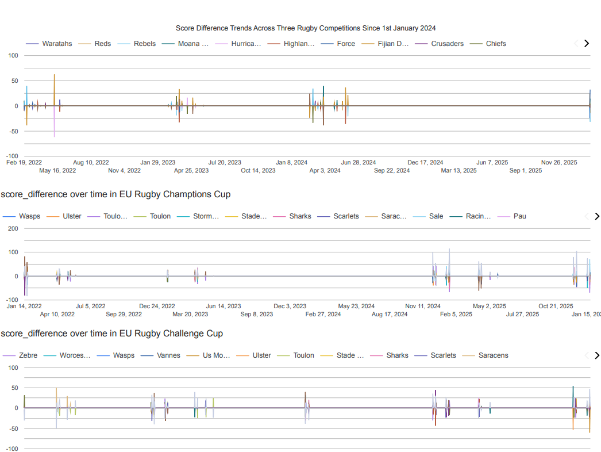
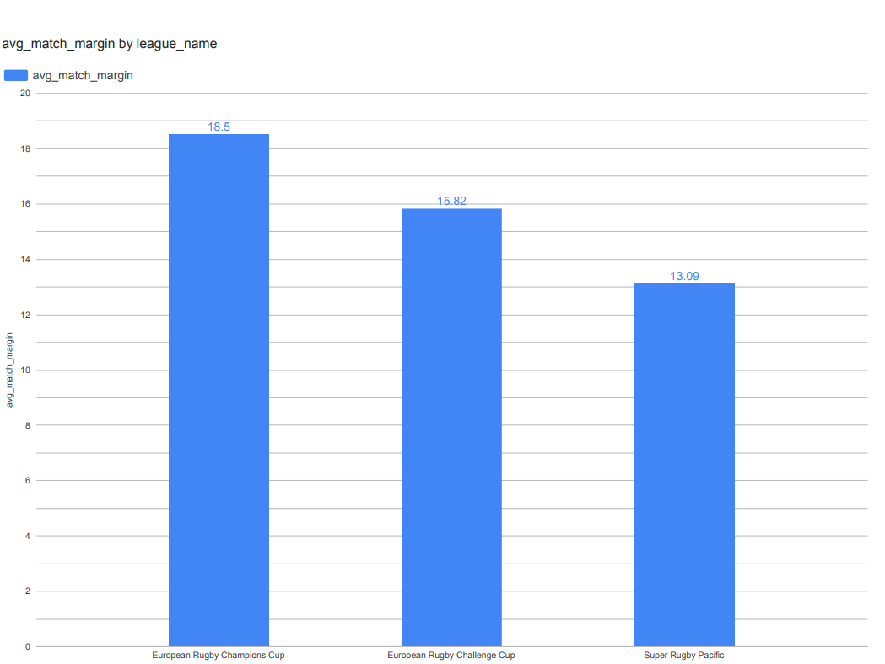
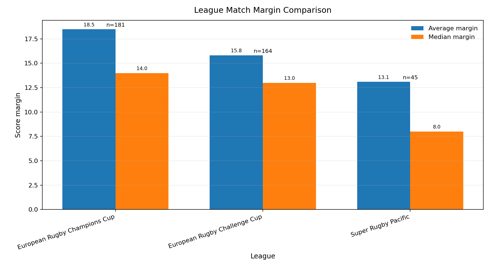
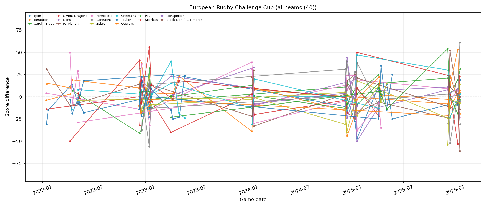
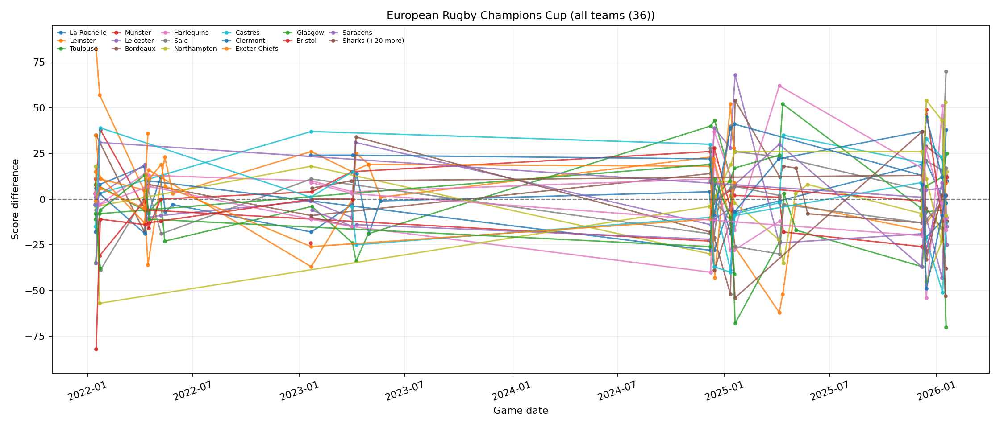
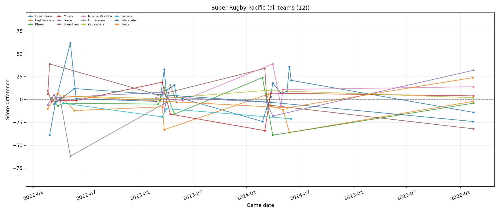

# Rugby Stats Pipeline

End-to-end batch pipeline for rugby team performance analytics using rugbypy, BigQuery, dbt, Kestra, and two presentation variants: Looker Studio and Matplotlib.

## Project Goal

Build a reproducible data pipeline that:

1. Ingests team and team-game statistics.
2. Loads raw data into BigQuery.
3. Applies dbt transformations and tests.
4. Serves dashboard-ready metrics.

## Tech Stack

- Orchestration: Kestra (Docker Compose)
- Ingestion/Load: Python scripts in `scripts/`
- Warehouse: BigQuery
- Transformations: dbt (`dbt/rugby_stats`)
- BI delivery: Looker Studio
- Code-first delivery: Matplotlib

## Architecture Overview

```mermaid
flowchart LR
  classDef source fill:#f3efe2,stroke:#7a5c2e,color:#2f2416,stroke-width:1px;
  classDef ingest fill:#d9ead3,stroke:#4f7a52,color:#1f3b21,stroke-width:1px;
  classDef raw fill:#dbe7f7,stroke:#4f6b8a,color:#1d2d44,stroke-width:1px;
  classDef transform fill:#fde7c8,stroke:#b7791f,color:#4a2b00,stroke-width:1px;
  classDef serve fill:#f7d9d9,stroke:#9b4d4d,color:#4a1f1f,stroke-width:1px;

  subgraph S1[Source]
    A[rugbypy API]
  end

  subgraph S2[Extraction and Orchestration]
    B[Kestra daily flow]
    C[Python fetch scripts]
  end

  subgraph S3[Raw Storage]
    D[data/raw/*.parquet]
    E[BigQuery raw tables]
  end

  subgraph S4[Transformations]
    F[dbt staging and intermediate models]
    G[fct_team_performance]
    H[dashboard marts]
  end

  subgraph S5[Analytics Delivery Variants]
    I[Looker Studio dashboard]
    J[Matplotlib chart artifacts]
  end

  A --> B --> C --> D --> E --> F --> G --> H --> I
  H --> J

  class A source;
  class B,C ingest;
  class D,E raw;
  class F,G,H transform;
  class I,J serve;
```



## Repository Structure

- `flows/rugby_pipeline_daily.yml`: Kestra flow (5 tasks: fetch teams, team stats, match details, load, dbt)
- `scripts/`: ingestion, load, and dbt execution scripts
- `dbt/rugby_stats/`: dbt project with staging/intermediate/marts models and tests
- `infra/terraform/`: Terraform configuration for infrastructure setup
- `docs/`: project objective and technical documentation
- `docs/testing.md`: smoke test usage and validation workflow
- `docs/assets/looker-studio/`: Looker Studio screenshots and report PDF used in this README

## Prerequisites

1. Docker and Docker Compose
2. GCP service account key at `secrets/cloud_key.json`
3. Access to your target BigQuery project

## Configuration

1. Copy `.env.example` to `.env` and set your values.
2. Copy `infra/terraform/terraform.tfvars.example` to `infra/terraform/terraform.tfvars` and set values if you will provision infrastructure from scratch.
3. Ensure `.env` and `infra/terraform/terraform.tfvars` use the same project and bucket naming convention.

## Makefile Commands

Run `make help` to see all targets. Common ones:

- `make build`: build the python container image
- `make kestra-up`: start Kestra stack
- `make ingest-all`: run fetch teams + team stats + match details
- `make load-bq`: load parquet files into BigQuery raw tables
- `make dbt-build`: run dbt build and tests
- `make validate-bq`: run milestone 4 BigQuery validations
- `make dashboard-evidence`: run milestone 6 dashboard evidence script
- `make matplotlib-dashboard`: generate Matplotlib dashboard charts to `docs/assets/matplotlib/`
- `make test-smoke`: run fast non-network smoke tests
- `make pipeline-local`: run `ingest-all -> load-bq -> dbt-build`

Load behavior note:

- `teams`: latest `teams_*.parquet` snapshot
- `team_stats`: all `data/raw/team_stats/*.parquet` files
- `match_details`: latest `match_details_*.parquet` snapshot (prevents duplicate `match_id` records from historical snapshots)

### Looker Studio Dashboard Pipeline

Use this when you want BI-first delivery with reviewer-friendly evidence artifacts.

```bash
make dashboard-evidence
```

Current behavior:

- Produces SQL checks and dashboard validation notes used for report QA
- Keeps tile requirements aligned with analytics views consumed by Looker Studio
- Supports milestone-style evidence packaging alongside screenshots and report PDF

See full documentation: `docs/pipelines/looker-studio/README.md`.

### Matplotlib Dashboard Pipeline

Use this when you want programmatic chart outputs stored in the repo.

```bash
make matplotlib-dashboard
```

Current behavior:

- One time-series chart per league (separate image files)
- Equal y-axis scaling across league time-series charts for comparability
- All teams plotted by default (optional cap via `MPL_MAX_TEAMS_PER_LEAGUE`)
- Compact legends with configurable limits

See full documentation: `docs/pipelines/matplotlib/README.md`.

### Pipeline Documentation Structure

The project has two documented delivery variants:

- Looker Studio pipeline docs: `docs/pipelines/looker-studio/README.md`
- Matplotlib pipeline docs: `docs/pipelines/matplotlib/README.md`
- Combined index: `docs/pipelines/README.md`

## Reproduction Steps

Run from repository root.

1. Clone and enter the repository:

  git clone https://github.com/tomkeane/rugby_data_project.git
  cd rugby_data_project

2. Create local configuration files:

  cp .env.example .env
  cp infra/terraform/terraform.tfvars.example infra/terraform/terraform.tfvars

3. Update `.env` and verify service account key path:
- Required key file location: `secrets/cloud_key.json`
- Keep `.env` values aligned with your GCP project and BigQuery datasets
- Dataset boundary: raw ingestion tables are written to `BQ_DATASET_RAW`; dbt models are written to `BQ_DATASET_ANALYTICS`.

4. Export environment variables for local commands:

  export GCP_PROJECT_ID=your-gcp-project-id
  export BQ_DATASET_RAW=raw
  export BQ_DATASET_ANALYTICS=analytics
  export GOOGLE_APPLICATION_CREDENTIALS=/workspace/secrets/cloud_key.json

5. Optional: provision infrastructure on a brand new cloud setup:

  cd infra/terraform
  terraform init
  terraform plan
  terraform apply
  cd ../..

6. Build the runtime image required by Kestra flow tasks:

  make build

7. Start Kestra stack:

  make kestra-up

8. Trigger the daily flow (UI or API):

- UI: `http://localhost:8080`
- Flow: `rugby.rugby_pipeline_daily`

9. Validate raw BigQuery tables (Milestone 4 utility):

  make validate-bq

10. Validate dbt models/tests/docs (Milestone 5):

  make dbt-build

11. Optional: generate dashboard query/checklist artifacts:

  make dashboard-evidence

Optional local end-to-end run (outside Kestra):

  make pipeline-local


## Dashboard Validation

### Looker Studio Tile Validation

1. Tile 1 (categorical distribution): `vw_league_margin_categorical`
   - Expected fields: `league_name`, `avg_match_margin`, `median_match_margin`, `matches`
  - Quick check query (replace placeholders with your values):

   select league_name, matches, avg_match_margin, median_match_margin
   from `YOUR_GCP_PROJECT_ID.YOUR_BQ_DATASET_ANALYTICS.vw_league_margin_categorical`
   order by league_name;

2. Tile 2 (temporal distribution): `vw_league_score_difference_timeseries`
   - Expected fields: `match_id`, `match_label`, `game_date`, `team_name`, `score_difference`, `league_name`
  - Quick check query (replace placeholders with your values):

   select game_date, match_id, match_label, team_name, score_difference, league_name
   from `YOUR_GCP_PROJECT_ID.YOUR_BQ_DATASET_ANALYTICS.vw_league_score_difference_timeseries`
   order by game_date desc
   limit 20;

3. Data quality guard (score symmetry):
   - `dbt/rugby_stats/tests/fct_team_performance_score_symmetry.sql`
   - `docs/score_difference_data_quality.md`

### Matplotlib Artifact Validation

1. Generate artifacts:

  make matplotlib-dashboard

2. Confirm categorical chart exists:
  - `docs/assets/matplotlib/league_margin_categorical_matplotlib.png`

3. Confirm league time-series charts exist:
  - `docs/assets/matplotlib/league_score_difference_timeseries_european_rugby_challenge_cup.png`
  - `docs/assets/matplotlib/league_score_difference_timeseries_european_rugby_champions_cup.png`
  - `docs/assets/matplotlib/league_score_difference_timeseries_super_rugby_pacific.png`

4. Data quality guard (shared with Looker Studio):
  - `dbt/rugby_stats/tests/fct_team_performance_score_symmetry.sql`
  - `docs/score_difference_data_quality.md`

## Deliverables

- Final report PDF: `docs/assets/looker-studio/Copy_of_rugby-datatalks-report.pdf`
- Report page screenshots:
  - `docs/assets/looker-studio/report-page-1.png`
  - `docs/assets/looker-studio/report-page-2.png`
- Matplotlib dashboard chart artifacts:
  - `docs/assets/matplotlib/league_margin_categorical_matplotlib.png`
  - `docs/assets/matplotlib/league_score_difference_timeseries_european_rugby_challenge_cup.png`
  - `docs/assets/matplotlib/league_score_difference_timeseries_european_rugby_champions_cup.png`
  - `docs/assets/matplotlib/league_score_difference_timeseries_super_rugby_pacific.png`
- Score-difference data quality remediation: `docs/score_difference_data_quality.md`
- Project objective: `docs/de_zoomcamp_project_spec.md`
- Historical project roadmap (planning snapshot): `docs/archive/rugby-stats-pipeline.md`
- Looker Studio pipeline documentation: `docs/pipelines/looker-studio/README.md`
- Matplotlib pipeline documentation: `docs/pipelines/matplotlib/README.md`
- rugbypy source notes: `docs/rugbypy.md`

## DE Zoomcamp Rubric Mapping

Use this section to quickly verify where each scoring criterion is evidenced.

1. Problem description
- Project objective and scope: `docs/de_zoomcamp_project_spec.md`
- End-to-end goal and business intent: `README.md` sections Project Goal and Architecture Overview

2. Cloud
- Warehouse and analytics platform: BigQuery
- Infrastructure as code: `infra/terraform/`
- Credentials and project configuration flow: Prerequisites + Configuration sections above

3. Data ingestion (batch + orchestration)
- Scheduled orchestration flow: `flows/rugby_pipeline_daily.yml`
- End-to-end task chain: fetch -> raw files -> BigQuery load -> dbt
- Local reproducible equivalent: `make pipeline-local`

4. Data warehouse
- Raw and analytics datasets in BigQuery
- Optimization strategy:
  - Partitioning: `team_stats` partitioned by `game_date`
  - Clustering: `team_stats` clustered by `team_id`
- Rationale is documented in Notes section below

5. Transformations
- dbt project: `dbt/rugby_stats/`
- Build + tests entrypoint: `make dbt-build`
- Custom data quality test example: `dbt/rugby_stats/tests/fct_team_performance_score_symmetry.sql`

6. Dashboard
- Tile 1 (categorical): `vw_league_margin_categorical`
- Tile 2 (temporal): `vw_league_score_difference_timeseries`
- Validation queries and required fields: Dashboard Tile Validation section
- Evidence artifacts: `docs/assets/looker-studio/` and `docs/assets/matplotlib/`

7. Reproducibility
- Full runbook: Reproduction Steps section
- One-command orchestration startup: `make kestra-up`
- End-to-end local run: `make pipeline-local`
- Validation and evidence generation:
  - `make validate-bq`
  - `make dbt-build`
  - `make dashboard-evidence`

## Reviewer Quick Audit (10 Checks)

Use this as a fast pass before assigning final points.

- [ ] Is the problem statement clear and specific?
- [ ] Is cloud infrastructure actually used (not local-only)?
- [ ] Is IaC present and linked to concrete resources?
- [ ] Is ingestion orchestrated end-to-end (not partial/manual)?
- [ ] Is a data lake layer present and used in the pipeline?
- [ ] Is a warehouse layer present and query-ready?
- [ ] Is DWH optimization evidenced (partitioning/clustering) with rationale?
- [ ] Are dbt transformations implemented and testable via `dbt build`?
- [ ] Does the dashboard clearly include both a categorical and a temporal view?
- [ ] Can a reviewer reproduce the pipeline from setup to validation using documented commands?

### Looker Studio Report Preview

The screenshots below are included as a quick preview of the submitted report deliverable.

Some score differences in the screenshots and PDF may appear one-sided. This is a known source-data limitation from the upstream API: certain teams are labelled as `"other"`, so the corresponding warehouse row exists but is not attributed to a named team in the rendered report. The pipeline data and symmetry test remain correct; the visual asymmetry reflects this naming gap in the source rather than a transformation error.





### Matplotlib Report Preview

The images below are generated by the code-first Matplotlib pipeline.
Matplotlib is cooler for iterative analysis because it gives you full control over chart logic, styling, layout, and export behavior directly in versioned code.

To refresh them:

```bash
make matplotlib-dashboard
```

Categorical chart:



Timeseries charts (one image per league):







## Notes

- `notebooks/` is intentionally git-ignored for local exploration only.
- Local raw extracts, secrets, dbt build outputs, and Terraform state are intentionally git-ignored.
- Score-difference symmetry is protected by a custom dbt data test in `dbt/rugby_stats/tests/fct_team_performance_score_symmetry.sql`.
- The `team_stats` BigQuery table is **partitioned by `game_date`** and **clustered by `team_id`**. Partitioning by date allows dashboard and dbt queries that filter on a season or date range to scan only the relevant partitions, reducing cost and latency. Clustering by `team_id` further optimises the most common access pattern: filtering or aggregating stats for a specific team.
