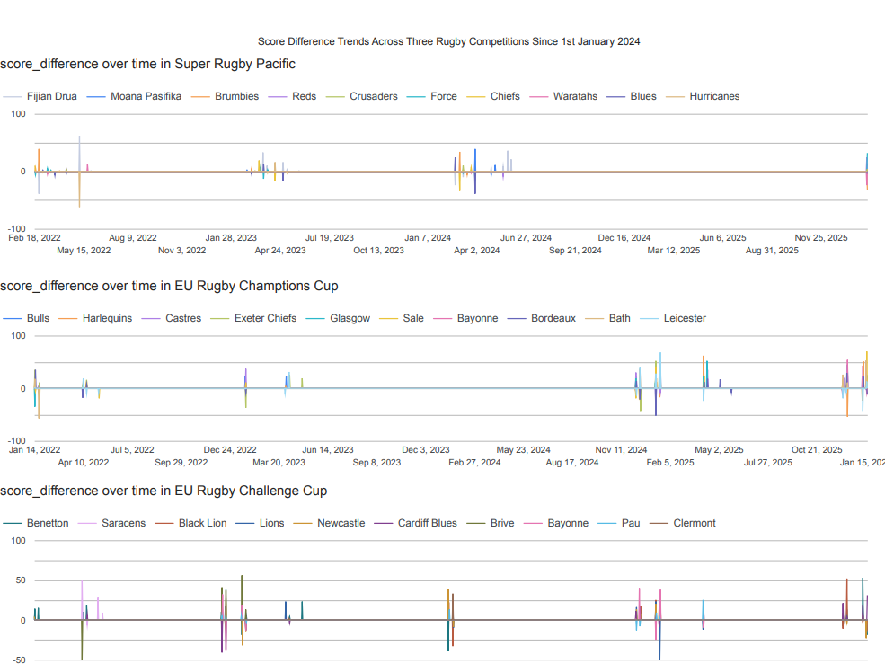
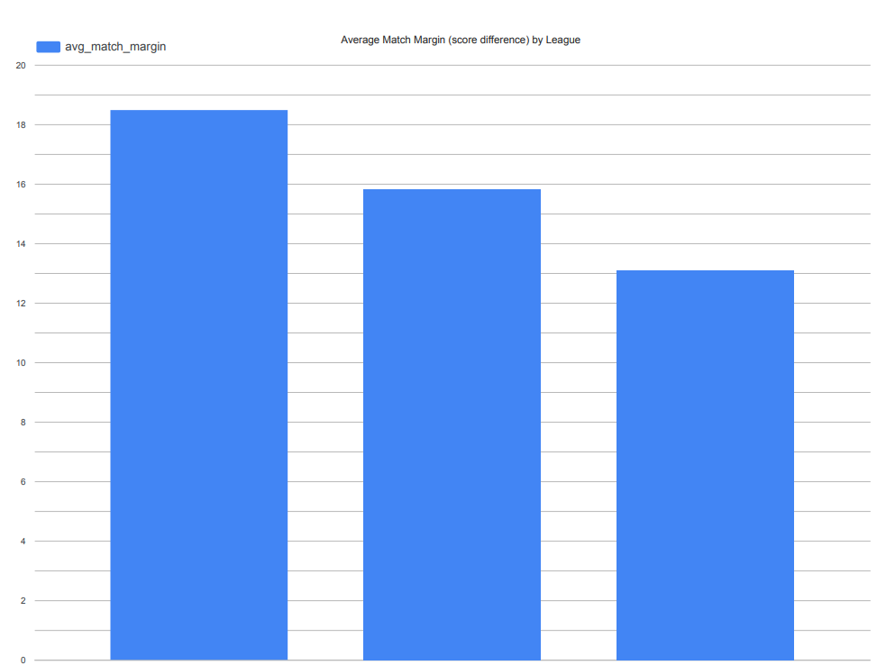

# Rugby Stats Pipeline

End-to-end batch pipeline for rugby team performance analytics using rugbypy, BigQuery, dbt, Kestra, and Looker Studio.

## Project Goal

Build a reproducible data pipeline that:

1. Ingests team and team-game statistics.
2. Loads raw data into BigQuery.
3. Applies dbt transformations and tests.
4. Serves dashboard-ready metrics.

## Tech Stack

- Orchestration: Kestra (Docker Compose)
- Ingestion/Load: Python scripts in `scripts/`
- Warehouse: BigQuery
- Transformations: dbt (`dbt/rugby_stats`)
- Dashboard: Looker Studio

## Repository Structure

- `flows/rugby_pipeline_daily.yml`: Kestra flow (5 tasks: fetch teams, team stats, match details, load, dbt)
- `scripts/`: ingestion, load, and dbt execution scripts
- `dbt/rugby_stats/`: dbt project with staging/intermediate/marts models and tests
- `infra/terraform/`: Terraform configuration for infrastructure setup
- `docs/`: project objective and technical documentation
- `docs/assets/screenshots/`: report page screenshots used in this README
- `Copy_of_rugby-datatalks-report.pdf`: final submission report deliverable

## Prerequisites

1. Docker and Docker Compose
2. GCP service account key at `secrets/cloud_key.json`
3. Access to your target BigQuery project

## Configuration

1. Copy `.env.example` to `.env` and set your values.
2. Ensure `infra/terraform/terraform.tfvars` uses the same project and bucket naming convention.

## Reproduction Steps

Run from repository root.

Set environment variables first:

```bash
export GCP_PROJECT_ID=your-gcp-project-id
export BQ_DATASET_RAW=raw
export BQ_DATASET_ANALYTICS=raw
export GOOGLE_APPLICATION_CREDENTIALS=/workspace/secrets/cloud_key.json
```

1. Start Kestra stack:

```bash
docker compose -f docker-compose.kestra.yml up -d
```

2. Trigger the daily flow (UI or API):

- UI: `http://localhost:8080`
- Flow: `rugby.rugby_pipeline_daily`

3. Validate raw BigQuery tables (Milestone 4 utility):

```bash
docker run --rm \
  -v $PWD:/workspace \
  -w /workspace \
  -e GOOGLE_APPLICATION_CREDENTIALS=/workspace/secrets/cloud_key.json \
  -e GCP_PROJECT_ID=$GCP_PROJECT_ID \
  -e BQ_DATASET_RAW=$BQ_DATASET_RAW \
  rugby_data_project-python:latest \
  python scripts/milestone4_validate_bq.py
```

4. Validate dbt models/tests/docs (Milestone 5):

```bash
docker run --rm \
  -v $PWD:/workspace \
  -w /workspace \
  -e GOOGLE_APPLICATION_CREDENTIALS=/workspace/secrets/cloud_key.json \
  -e GCP_PROJECT_ID=$GCP_PROJECT_ID \
  -e BQ_DATASET_RAW=$BQ_DATASET_RAW \
  -e BQ_DATASET_ANALYTICS=$BQ_DATASET_ANALYTICS \
  rugby_data_project-python:latest \
  dbt build --project-dir dbt/rugby_stats --profiles-dir dbt/rugby_stats
```

5. (Optional) Generate dashboard query/checklist artifacts:

```bash
docker run --rm \
  -v $PWD:/workspace \
  -w /workspace \
  -e GOOGLE_APPLICATION_CREDENTIALS=/workspace/secrets/cloud_key.json \
  -e GCP_PROJECT_ID=$GCP_PROJECT_ID \
  -e BQ_DATASET_RAW=$BQ_DATASET_RAW \
  rugby_data_project-python:latest \
  python scripts/milestone6_prepare_dashboard_evidence.py
```

## Deliverables

- Final report PDF: `Copy_of_rugby-datatalks-report.pdf`
- Report page screenshots:
  - `docs/assets/screenshots/report-page-1.png`
  - `docs/assets/screenshots/report-page-2.png`
- Score-difference data quality remediation: `docs/score_difference_data_quality.md`
- Project objective: `docs/project_objective.md`
- Pipeline design and implementation notes: `docs/rugby-stats-pipeline.md`
- rugbypy source notes: `docs/rugbypy.md`

### Report Preview





## Notes

- `notebooks/` is intentionally git-ignored for local exploration only.
- Local raw extracts, secrets, dbt build outputs, and Terraform state are intentionally git-ignored.
- Score-difference symmetry is protected by a custom dbt data test in `dbt/rugby_stats/tests/fct_team_performance_score_symmetry.sql`.
