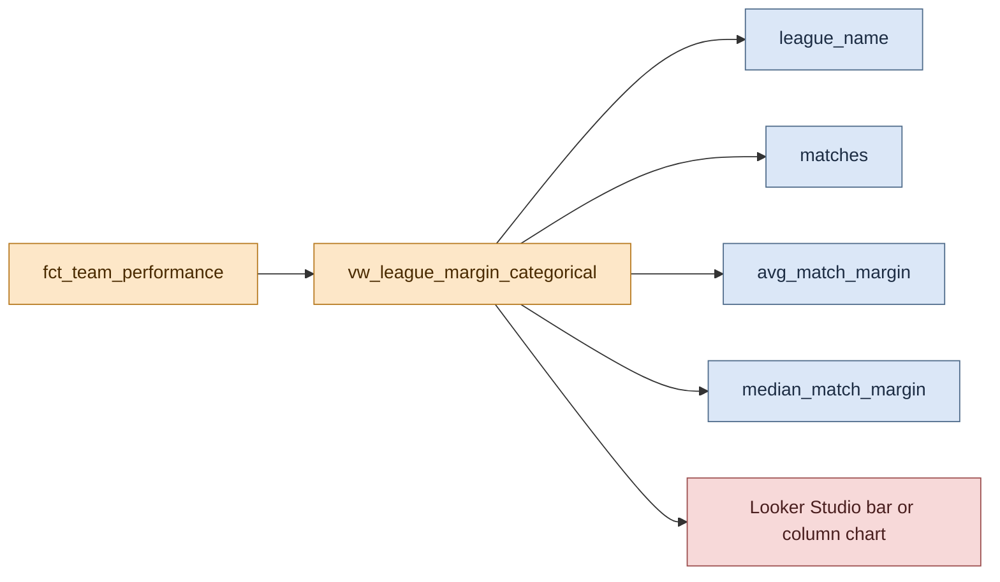

# Graph Development: League Margin Categorical

This page documents the categorical dashboard graph backed by `vw_league_margin_categorical`.

## Visual Overview



```text
fct_team_performance
    |
    v
vw_league_margin_categorical
   |        |         |
   |        |         +--> median_match_margin
   |        +------------> avg_match_margin
   +---------------------> matches by league_name
    |
    v
categorical comparison chart
```

## Graph Purpose

This graph compares leagues at an aggregate level by showing how large match score margins tend to be within each competition group.

It answers questions such as:

- Which competition tends to produce the largest winning margins?
- Are some leagues more balanced than others?
- How many matches are contributing to each league-level comparison?

This makes it the categorical graph required by the project specification.

## Backing Model

The graph is powered by [dbt/rugby_stats/models/marts/vw_league_margin_categorical.sql](/home/tomkeane/projects/rugby_data_project/dbt/rugby_stats/models/marts/vw_league_margin_categorical.sql).

That view reads from the shared fact model documented in [Fact Model and Data Quality Guards](../shared/fact_model_and_quality_guards.md).

## Grain

The output grain is one row per `league_name`.

Each row contains:

- `league_name`
- `matches`
- `avg_match_margin`
- `median_match_margin`

This is intentionally coarse-grained because the graph is designed for cross-league comparison rather than match-level exploration.

## Transformation Logic

The model applies three main rules:

1. Filter out rows where `score_difference` is null.
2. Map raw competition identifiers and names into a smaller reporting dimension called `league_name`.
3. Aggregate across matches per league.

The league mapping currently includes:

- European Rugby Challenge Cup
- European Rugby Champions Cup
- Super Rugby Pacific

The aggregation logic uses:

- `count(distinct match_id)` for total matches
- `avg(abs(score_difference))` for average margin size
- `approx_quantiles(abs(score_difference), 100)[offset(50)]` for median margin size

Using absolute score difference is important because the graph is measuring margin size, not whether the row belongs to the winning or losing team.

## Why This Model Is a View

The model is materialized as a dbt view because:

- It is small and cheap to compute.
- It depends on an already-curated fact model.
- The logic is simple enough that duplicating storage would add little benefit.

If the dashboard later expands to many more leagues or much larger match volumes, materializing as a table could be reconsidered.

## Dashboard Usage

Recommended chart usage in Looker Studio:

- Dimension: `league_name`
- Metrics: `avg_match_margin`, optionally `median_match_margin`
- Supporting metric: `matches`

The chart should make it clear whether it is presenting average margin, median margin, or both. If both are shown, the title should say so explicitly.

## Shared Dependencies

This graph shares upstream components with the timeseries graph:

- [Pipeline Orchestration and Loading](../shared/pipeline_orchestration_and_loading.md)
- [Fact Model and Data Quality Guards](../shared/fact_model_and_quality_guards.md)

## Known Design Constraint

Because league names are derived from a hard-coded competition mapping, newly introduced competitions will not appear in this view until the mapping logic is extended.
