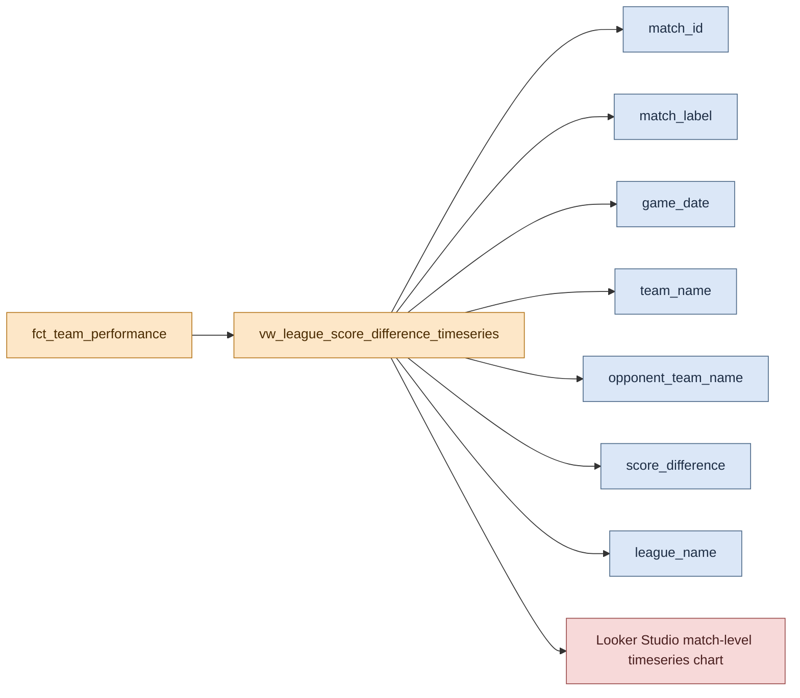

# Graph Development: League Score Difference Timeseries

This page documents the temporal dashboard graph backed by `vw_league_score_difference_timeseries`.

## Visual Overview



```text
fct_team_performance
    |
    v
vw_league_score_difference_timeseries
   |        |          |           |
   |        |          |           +--> score_difference
   |        |          +--------------> team_name / opponent_team_name
   |        +-------------------------> game_date
   +----------------------------------> match_id + match_label
    |
    v
match-level temporal chart
```

## Graph Purpose

This graph shows how team score differences vary across individual matches over time.

It answers questions such as:

- How did a team perform from match to match within a league?
- Which fixtures were close contests and which were lopsided wins or losses?
- How do score-difference patterns vary across supported leagues?

This makes it the temporal graph required by the project specification.

## Backing Model

The graph is powered by [dbt/rugby_stats/models/marts/vw_league_score_difference_timeseries.sql](/home/tomkeane/projects/rugby_data_project/dbt/rugby_stats/models/marts/vw_league_score_difference_timeseries.sql).

That view reads from the shared fact model documented in [Fact Model and Data Quality Guards](../shared/fact_model_and_quality_guards.md).

## Grain

The output grain is one row per team per match.

Each row contains:

- `match_id`
- `match_label`
- `game_date`
- `team_name`
- `opponent_team_name`
- `score_difference`
- `competition_id`
- `competition_name`
- `league_name`

This grain matters because a date alone is not specific enough: multiple matches can occur on the same day in the same league.

## Transformation Logic

The model applies four main steps:

1. Select team-level match rows from `fct_team_performance`.
2. Create a stable `match_label` by combining `game_date` with the alphabetically ordered team names for the match.
3. Map competitions into the reporting `league_name` dimension.
4. Filter out rows where the league is outside the supported reporting set.

The supported league mapping currently includes:

- European Rugby Challenge Cup
- European Rugby Champions Cup
- Major League Rugby
- Super Rugby Pacific

## Why `match_id` and `match_label` Are Included

The timeseries view includes `match_id` and `match_label` to preserve match-level identity in downstream charts.

Without those fields, a chart grouped only by `game_date` can collapse multiple fixtures into one point, which obscures the two-row structure of each match. Including an explicit match-level identifier keeps the visualization aligned with the warehouse grain.

## Dashboard Usage

Recommended chart usage in Looker Studio:

- Primary dimension: `match_label`
- Breakdown dimension: `team_name`
- Metric: `score_difference`
- Optional filter: `league_name`

If a date-oriented chart is preferred for presentation, keep `match_id` or `match_label` available in the data source so same-day fixtures remain distinguishable.

## Data Quality Expectations

This graph inherits the score symmetry guarantees from the shared fact model and custom dbt test:

- Each valid match should contribute exactly two rows.
- The two `score_difference` values for a match should sum to zero.

Those guarantees are documented in [Fact Model and Data Quality Guards](../shared/fact_model_and_quality_guards.md).

## Shared Dependencies

This graph shares upstream components with the categorical graph:

- [Pipeline Orchestration and Loading](../shared/pipeline_orchestration_and_loading.md)
- [Fact Model and Data Quality Guards](../shared/fact_model_and_quality_guards.md)

## Known Design Constraint

Some source records can contain team labels such as `other` from the upstream API. When that happens, the warehouse row still exists, but the displayed team naming may be less informative than the underlying match record.
