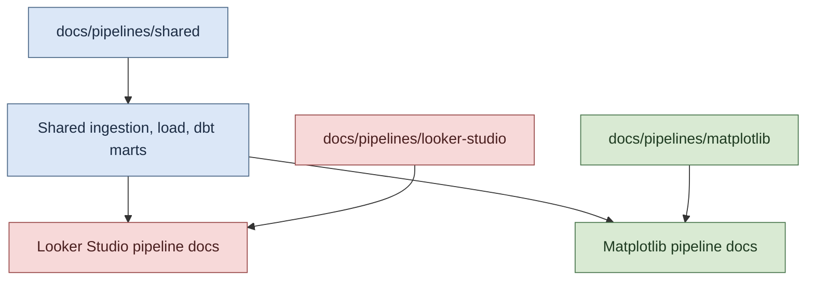

# Pipeline Documentation Index

This directory separates documentation for the two pipeline presentation tracks used in the project.

## Illustration

## Pipeline Variants

- [Looker Studio Pipeline Documentation](./looker-studio/README.md)
- [Matplotlib Pipeline Documentation](./matplotlib/README.md)

## Shared Components

- [Shared Pipeline Components](./shared/README.md)

## How To Use This Structure

1. Use the Looker Studio track for BI dashboard configuration and graph semantics in the hosted report tool.
2. Use the Matplotlib track for code-first chart rendering, artifact generation, and reproducible image outputs.
3. Use both when comparing parity between dashboard and code-rendered outputs.
4. Use the shared section for ingestion, loading, and transformation components common to both variants.
