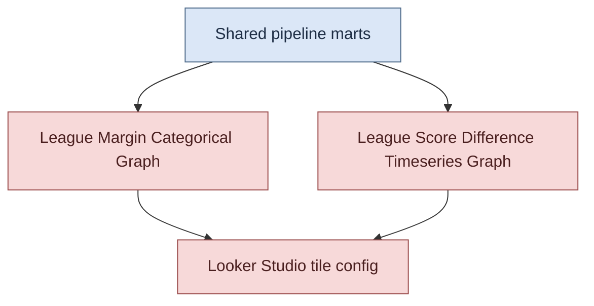

# Looker Studio Pipeline Documentation

This directory documents the Looker Studio version of the analytics pipeline.

## Illustration

## Graph Documentation

- [League Margin Categorical Graph](./graphs/league_margin_categorical.md)
- [League Score Difference Timeseries Graph](./graphs/league_score_difference_timeseries.md)

## Shared Components

- [Pipeline Orchestration and Loading](../shared/pipeline_orchestration_and_loading.md)
- [Fact Model and Data Quality Guards](../shared/fact_model_and_quality_guards.md)
- [Inspecting fct_team_performance Schema](../shared/fct_team_performance_schema_inspection.md)
- [Ruck Data Availability Profile](../shared/ruck_data_availability_profile.md)

## Recommended Reading Order

1. Read the shared component pages first to understand ingestion, loading, transformation, and quality controls.
2. Read each graph page for graph-specific mart logic, business meaning, and Looker Studio usage.
