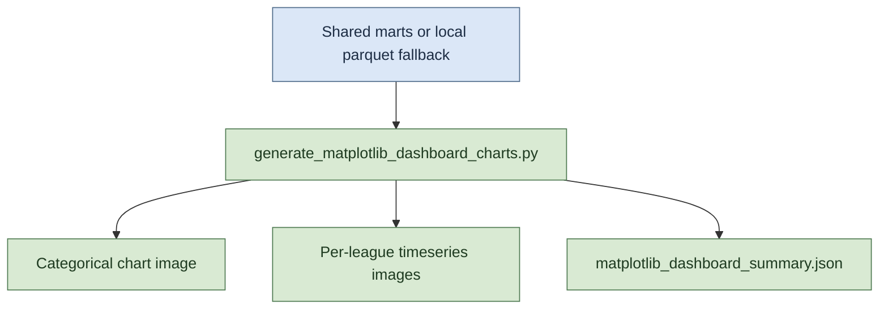

# Matplotlib Dashboard Development Documentation

This directory documents the Matplotlib pipeline variant and mirrors the structure used for the Looker Studio pipeline docs.

## Illustration

## Graph Documentation

- [League Margin Categorical Graph (Matplotlib)](./graphs/league_margin_categorical_matplotlib.md)
- [League Score Difference Timeseries Graph (Matplotlib)](./graphs/league_score_difference_timeseries_matplotlib.md)

## Shared Components

- [Matplotlib Pipeline Runtime and Configuration](./shared/matplotlib_pipeline_runtime_and_config.md)

## Recommended Reading Order

1. Read the shared component page first to understand data sources, runtime controls, and output conventions.
2. Read each graph page for chart-specific logic, behavior, and artifact naming.
