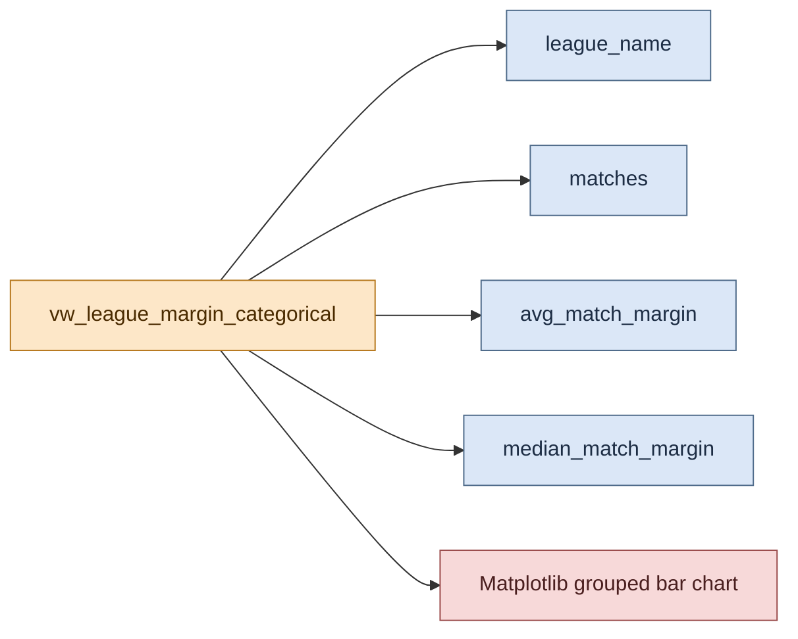

# Graph Development: League Margin Categorical (Matplotlib)

This page documents the Matplotlib categorical chart generated from `vw_league_margin_categorical`.

## Visual Overview

## Graph Purpose

This chart compares average and median match margins across leagues in a single categorical view.

It supports quick comparison of league-level competitiveness and sample size.

## Backing Inputs

Primary columns used:

- `league_name`
- `matches`
- `avg_match_margin`
- `median_match_margin`

Input source is selected by runtime mode:

- BigQuery mart `vw_league_margin_categorical`
- or local parquet-derived equivalent

## Rendering Logic

The chart renderer:

1. Sorts leagues by `avg_match_margin` descending.
2. Plots side-by-side bars for average and median margin.
3. Annotates each league with match count (`n=...`).
4. Annotates bar tops with rounded metric values.

## Output Artifact

Default output path:

- `docs/assets/matplotlib/league_margin_categorical_matplotlib.png`

## Shared Dependencies

This graph shares runtime controls and source-mode behavior with the timeseries chart:

- [Matplotlib Pipeline Runtime and Configuration](../shared/matplotlib_pipeline_runtime_and_config.md)
