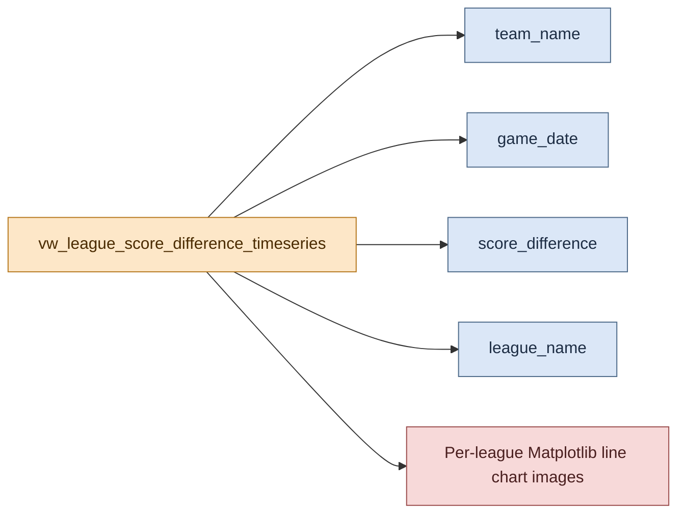

# Graph Development: League Score Difference Timeseries (Matplotlib)

This page documents the Matplotlib timeseries charts generated from `vw_league_score_difference_timeseries`.

## Visual Overview

## Graph Purpose

These charts show match-by-match score-difference trajectories per team within each league.

Each league is written to its own image file to improve readability and avoid overcrowded subplot layouts.

## Backing Inputs

Primary columns used:

- `match_id`
- `game_date`
- `team_name`
- `opponent_team_name`
- `score_difference`
- `league_name`

Input source is selected by runtime mode:

- BigQuery mart `vw_league_score_difference_timeseries`
- or local parquet-derived equivalent

## Rendering Logic

For each league:

1. Select all teams by default (or top-N if `MPL_MAX_TEAMS_PER_LEAGUE` is set).
2. Plot one line per team with date on x-axis and score difference on y-axis.
3. Apply a shared y-axis scale across all league charts for comparability.
4. Render a compact legend using configurable entry and row caps.

## Output Artifacts

Default output naming pattern:

- `docs/assets/matplotlib/league_score_difference_timeseries_<league_slug>.png`

Examples:

- `docs/assets/matplotlib/league_score_difference_timeseries_european_rugby_challenge_cup.png`
- `docs/assets/matplotlib/league_score_difference_timeseries_european_rugby_champions_cup.png`
- `docs/assets/matplotlib/league_score_difference_timeseries_super_rugby_pacific.png`

## Shared Dependencies

This graph shares runtime controls and source-mode behavior with the categorical chart:

- [Matplotlib Pipeline Runtime and Configuration](../shared/matplotlib_pipeline_runtime_and_config.md)
