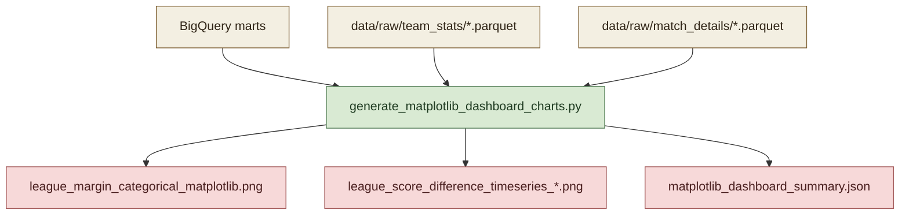

# Shared Component: Matplotlib Pipeline Runtime and Configuration

This page describes the shared runtime behavior used by all Matplotlib dashboard charts.

## Visual Overview

## Purpose

The Matplotlib pipeline provides code-first, reproducible chart images without manual dashboard authoring.

It is intended for:

- report artifacts committed to the repository
- deterministic reruns across environments
- visual validation of mart outputs

## Runtime Entrypoint

Main script:

- `scripts/generate_matplotlib_dashboard_charts.py`

Make target:

- `make matplotlib-dashboard`

## Data Source Strategy

The runtime supports two source modes:

1. BigQuery views (`MPL_DATA_SOURCE=bigquery`)
2. Local parquet fallback (`MPL_DATA_SOURCE=local`)

Default mode is `auto`, which attempts BigQuery first and falls back to local parquet if needed.

## Environment Controls

- `MPL_DATA_SOURCE`: `auto`, `bigquery`, or `local`
- `MPL_MAX_TEAMS_PER_LEAGUE`: if unset/empty or <= 0, plot all teams; otherwise apply top-N cap
- `MPL_MAX_LEGEND_ENTRIES`: cap legend entries per chart
- `MPL_LEGEND_MAX_ROWS`: legend row cap used to compute multi-column layout
- `MATPLOTLIB_DASHBOARD_OUTPUT_DIR`: output directory for all generated artifacts

## Output Contracts

Charts are written to `docs/assets/matplotlib/` by default:

- one categorical chart image
- one time-series image per league
- one summary JSON with source metadata, row counts, and generated output paths

The summary file is:

- `docs/assets/matplotlib/matplotlib_dashboard_summary.json`

## Design Constraints

- Local fallback requires parquet extracts in `data/raw/team_stats` and `data/raw/match_details`.
- League naming uses explicit mapping logic in the script, so new competitions may require mapping updates.
- In containerized runs, dependency corruption can surface as import errors; reinstalling container packages restores runtime in those cases.
