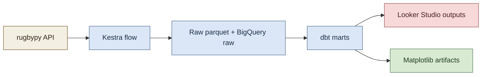

# Shared Pipeline Components

This directory documents components shared by both pipeline variants:

- Looker Studio pipeline (`docs/pipelines/looker-studio`)
- Matplotlib pipeline (`docs/pipelines/matplotlib`)

## Illustration

## Shared Components

- Ingestion and orchestration flow: `flows/rugby_pipeline_daily.yml`
- Fetch scripts: `scripts/fetch_teams.py`, `scripts/fetch_team_stats.py`, `scripts/fetch_match_details.py`
- Warehouse load: `scripts/load_to_bigquery.py`
- Transformations and tests: `scripts/run_dbt.py`, `dbt/rugby_stats/`
- Core marts consumed by both variants:
  - `vw_league_margin_categorical`
  - `vw_league_score_difference_timeseries`

## Why This Exists

Both variants diverge at presentation/output only (Looker Studio dashboards vs Matplotlib artifacts). Upstream ingestion, modeling, and quality controls are shared.
