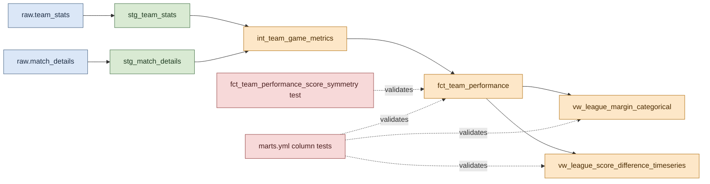

# Shared Component: Fact Model and Data Quality Guards

This page documents the shared transformation backbone used by both dashboard graphs.

## Visual Overview



Character sketch of the transformation lineage:

```text
raw.team_stats -------> stg_team_stats ---------
                                             \
                                              +--> int_team_game_metrics --> fct_team_performance --> categorical view
                                             /                                     |
raw.match_details ----> stg_match_details --                                      +--> timeseries view
                                                                                  |
                                                                                  +--> custom symmetry test
                                                                                  +--> marts.yml tests
```

## Purpose

Both graphs read from marts that depend on the same fact table: `fct_team_performance`.

That fact table standardises match-level team performance records so downstream views can focus on presentation logic rather than repeated cleansing and enrichment logic.

## Shared Model Lineage

The shared dbt lineage is:

1. [dbt/rugby_stats/models/staging/stg_team_stats.sql](../../../dbt/rugby_stats/models/staging/stg_team_stats.sql)
2. [dbt/rugby_stats/models/staging/stg_match_details.sql](../../../dbt/rugby_stats/models/staging/stg_match_details.sql)
3. [dbt/rugby_stats/models/intermediate/int_team_game_metrics.sql](../../../dbt/rugby_stats/models/intermediate/int_team_game_metrics.sql)
4. [dbt/rugby_stats/models/marts/fct_team_performance.sql](../../../dbt/rugby_stats/models/marts/fct_team_performance.sql)

The two graph-specific views are built on top of `fct_team_performance`.

## Staging Models

### `stg_team_stats`

This model performs the first structured cleanup of the raw `team_stats` table.

Responsibilities:

- Cast identifiers and metrics to stable BigQuery types.
- Rename source columns into analytics-friendly names such as `team_name`, `opponent_team_name`, and `entries_22m`.
- Derive `season` from `game_date`.
- Deduplicate duplicate `(team_id, match_id)` records using the most recent `game_date`.
- Build a stable `team_game_key` as `team_id-match_id`.

This ensures that downstream calculations are based on one canonical row per team per match.

### `stg_match_details`

This model standardises the match metadata required for league and competition enrichment.

Responsibilities:

- Cast `match_id`, `game_date`, `season`, `competition_id`, and `competition_name`.
- Filter out null `match_id` values.

This keeps the competition mapping logic out of the raw layer and makes match enrichment easier to reason about.

## Intermediate Model

### `int_team_game_metrics`

This is the most important shared model for both graphs.

Responsibilities:

- Keep only rows where both `score` and `opponent_score` are present.
- Keep only complete matches where exactly two distinct teams are present.
- Join cleaned team stats to match metadata.
- Compute `score_difference` as `score - opponent_score`.
- Derive `winner_flag` as `W`, `L`, or `D`.

The completeness filter is especially important because it prevents one-team matches from contaminating downstream dashboard metrics.

## Fact Model

### `fct_team_performance`

This mart exposes the team-by-match grain used by both dashboard views.

Core fields include:

- Team and opponent identity
- Match date and season
- Competition metadata
- Match scoring metrics
- Rolling five-game averages for tries, line breaks, and territory

Even though the current two graphs do not use the rolling metrics, keeping them in the fact model makes the mart extensible for future dashboard tiles.

## Data Quality Guards

The strongest shared quality guard is the custom dbt test in [dbt/rugby_stats/tests/fct_team_performance_score_symmetry.sql](../../../dbt/rugby_stats/tests/fct_team_performance_score_symmetry.sql).

It fails if either of the following is true for any `match_id`:

- The match does not have exactly two team rows.
- The two `score_difference` values do not sum to zero within a small tolerance.

Additional column-level tests are declared in [dbt/rugby_stats/models/marts/marts.yml](../../../dbt/rugby_stats/models/marts/marts.yml), including `not_null`, `unique`, and `accepted_values` checks.

## Why This Shared Layer Exists

Separating the common fact model from the graph-specific marts has two benefits:

1. Shared business rules are defined once and reused consistently.
2. Dashboard-specific models stay small and focused on aggregation and presentation.

The graph pages reference this shared layer rather than re-documenting it.
