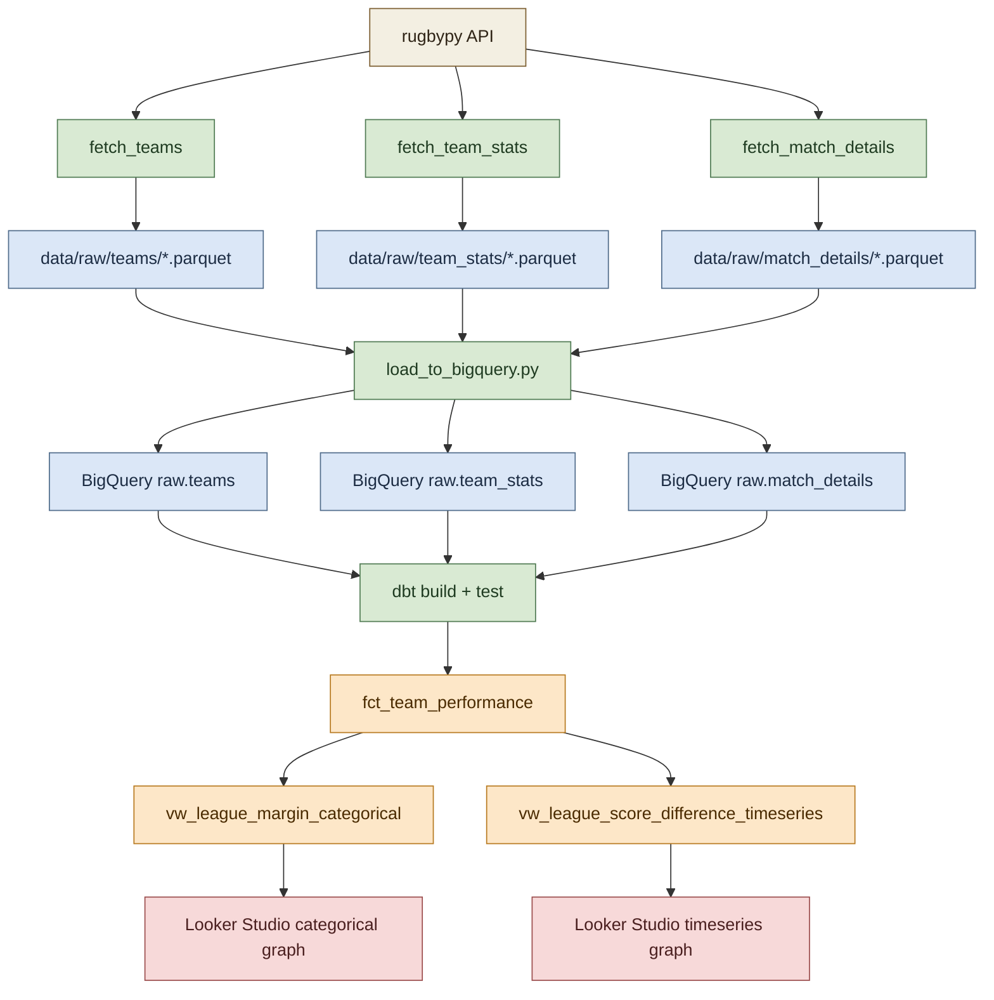

# Shared Component: Pipeline Orchestration and Loading

This page describes the shared upstream pipeline components used by both dashboard graphs.

## Visual Overview



Character sketch of the same flow:

```text
rugbypy API
	|
	+--> fetch_teams ----------> data/raw/teams/*.parquet ---------
	|                                                           |
	+--> fetch_team_stats -----> data/raw/team_stats/*.parquet   +--> load_to_bigquery.py
	|                                                           |         |
	+--> fetch_match_details -> data/raw/match_details/*.parquet --------+
																	  |
																	  v
															BigQuery raw tables
																	  |
																	  v
																dbt build + test
																	  |
																	  v
															fct_team_performance
															  /                \
															 v                  v
									vw_league_margin_categorical   vw_league_score_difference_timeseries
															 |                  |
															 v                  v
											   categorical graph     timeseries graph
```

## Purpose

Both graphs depend on the same batch pipeline stages:

1. Extract rugby data from the `rugbypy` package into local parquet files.
2. Load those parquet files into BigQuery raw tables.
3. Run dbt models and tests to publish dashboard-ready views.

The graph-specific marts diverge only after the shared fact model is built.

## Orchestration Layer

The end-to-end job is orchestrated by Kestra in [flows/rugby_pipeline_daily.yml](../../../flows/rugby_pipeline_daily.yml).

The flow runs five tasks in order:

1. `fetch_teams`
2. `fetch_team_stats`
3. `fetch_match_details`
4. `load_to_bigquery`
5. `run_dbt`

This sequencing matters because downstream steps assume that fresh raw parquet files and raw BigQuery tables already exist.

## Extraction Scripts

The main shared extraction logic lives in [scripts/ingest_rugby_data.py](../../../scripts/ingest_rugby_data.py), with Kestra invoking the narrower task-specific scripts for teams, team stats, and match details.

Key behaviours in the ingestion pattern:

- Team metadata is fetched first so later tasks have a current list of `team_id` values.
- Team stats are written to `data/raw/team_stats/*.parquet`.
- Run summaries are written to `data/raw/run_summaries/` for traceability.
- Failures are recorded rather than silently discarded.

This raw-zone design keeps the extraction stage simple and auditable. It also allows the warehouse load step to be re-run without having to call the source API again.

## Raw BigQuery Load

The warehouse load step is implemented in [scripts/load_to_bigquery.py](../../../scripts/load_to_bigquery.py).

It loads three raw tables:

- `raw.teams`
- `raw.team_stats`
- `raw.match_details`

Important implementation details:

- `teams` loads from the latest `teams_*.parquet` snapshot.
- `team_stats` loads by concatenating all files in `data/raw/team_stats/*.parquet`.
- `match_details` loads from the latest `match_details_*.parquet` snapshot to avoid duplicate `match_id` values across historical snapshot files.
- Object columns containing lists or dictionaries are JSON-serialized so BigQuery receives scalar-compatible values.
- `game_date` is normalized to a date type before loading.
- `raw.team_stats` is partitioned by `game_date` and clustered by `team_id`.
- `raw.match_details` is partitioned by `game_date` and clustered by `competition_id`.

These storage choices directly support the dashboard workload, which commonly filters by date range, competition, and team.

## dbt Build Step

The transformation step is launched by [scripts/run_dbt.py](../../../scripts/run_dbt.py).

The script runs:

1. `dbt build`
2. `dbt test`

If `dbt build` fails, tests are not treated as valid and the script exits with a non-zero status. This is important operationally because both dashboard graphs should only be refreshed from validated transformation outputs.

## Dependency Boundary

Both graphs share everything on this page. Their logic only starts to differ after dbt publishes the shared fact model documented in [Fact Model and Data Quality Guards](./fact_model_and_quality_guards.md).
